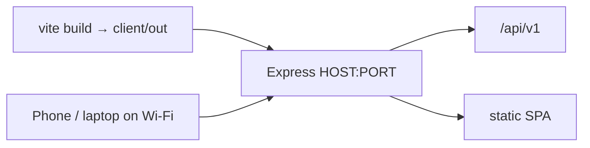

# Deploy — Biogas_MIS_Vizag style (single LAN URL)

This matches **Biogas_MIS_Vizag**: build the React client once, run **only** the Node server, open one Wi‑Fi URL.



## Why Vizag works on LAN

| Setting | Vizag | ITAM (this project) |
|---------|-------|---------------------|
| `SERVE_CLIENT` | `true` | `true` |
| UI + API port | same (`3015`) | same (`3001`) |
| Client API URL | `window.location.origin + /api` | `origin + /api/v1` |
| HTTP on `10.x.x.x` | Helmet **does not** force HTTPS | same (`FORCE_HTTPS=false`) |
| Listen | `0.0.0.0` / LAN | `HOST=0.0.0.0` |

## Quick start (LAN for all Wi‑Fi devices)

1. **Build UI**

```powershell
cd client
npm ci
npm run build
```

2. **`server/.env`** (example — use your current Wi‑Fi IP)

```env
SERVE_CLIENT=true
HOST=0.0.0.0
PORT=3001
PUBLIC_APP_URL=http://10.5.7.225:3001
FRONTEND_URL=http://10.5.7.225:3001
CLIENT_ORIGIN=http://localhost:3001,http://10.5.7.225:3001
FORCE_HTTPS=false
```

3. **Start only the server**

```powershell
cd server
npm start
# or: npm run dev
```

4. **Open on any device on the same Wi‑Fi**

`http://10.5.7.225:3001`

Login still requires an App User whose email is in `ALLOWED_LOGIN_EMAILS`.

Find your IP:

```powershell
Get-NetIPAddress -AddressFamily IPv4 | Where-Object { $_.IPAddress -like '10.*' -or $_.IPAddress -like '192.168.*' }
```

If the IP changes, update `PUBLIC_APP_URL` / `FRONTEND_URL` / `CLIENT_ORIGIN` and restart. Re-print asset labels so QR codes use the new base.

## Docker (same as Vizag)

```powershell
docker network create proxy   # once
docker compose up -d
```

## Dev split (optional)

`SERVE_CLIENT=false` → Vite `:5173` + API `:3001`. Vite proxies `/api` and `/storage`.

## ITAgent

```powershell
$env:REFEX_API_URL = "http://10.5.7.225:3001/api/v1"
```
