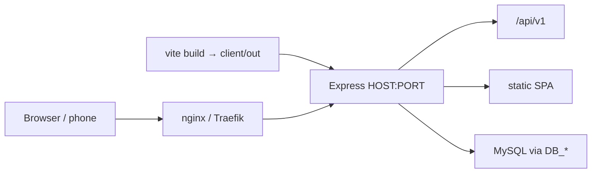

# Deploy — Biogas_MIS style (domain + port via `.env`)

Same hosting model as **Biogas_MIS** / **Biogas_MIS_Vizag**:

1. Choose an available **PORT** and public **domain**
2. Put them (and **DB_***) in `server/.env`
3. Build the client once → `client/out`
4. Run one Node process (`SERVE_CLIENT=true`) behind your existing **proxy** network
5. Map domain → `itam-2026:<PORT>` in nginx / Traefik (outside this repo)



## 1. Database (MySQL in Docker + dump/import)

`docker-compose.yml` includes **`itam-mysql`** so you can export locally and import on the server.

### A) Export from your local PC

```powershell
# Uses DB_* from env, or pass -Host/-Port/-User/-Password/-Database
cd server
.\scripts\db-export.ps1 -OutFile ..\itam-dump.sql
```

### B) On the server — start stack, then import

```powershell
# Edit server/.env: PORT, domain, DB_USER / DB_PASSWORD / MYSQL_ROOT_PASSWORD
docker network create proxy   # once
docker compose up -d

# Import dump into compose MySQL (published on host :3307 by default)
.\server\scripts\db-import.ps1 -InFile .\itam-dump.sql -Port 3307
# or:
.\server\scripts\db-import.ps1 -InFile .\itam-dump.sql -ViaDocker
```

Then apply any newer migrations (safe if dump is current):

```bash
docker exec -it itam-2026 npm run migrate
```

| From host | Value |
|-----------|--------|
| MySQL host port | `MYSQL_PUBLISH_PORT` (default **3307**) |
| In-container DB host for app | `db` (set by compose) |
| Database / user | `DB_NAME` / `DB_USER` / `DB_PASSWORD` in `.env` |

Fresh install without a dump:

```bash
docker compose up -d
docker exec -it itam-2026 npm run migrate
docker exec -it itam-2026 npm run seed
```

## 2. Configure `server/.env`

```bash
cd server
cp .env.example .env
# edit PORT, FRONTEND_URL / PUBLIC_APP_URL / CLIENT_ORIGIN, DB_*, JWT_SECRET, …
```

Essential production values:

```env
PORT=3001
HOST=0.0.0.0
NODE_ENV=production
SERVE_CLIENT=true

# Public URL users open (your mapped domain — not a LAN IP)
FRONTEND_URL=https://itam.your-domain.com
PUBLIC_APP_URL=https://itam.your-domain.com
CLIENT_ORIGIN=https://itam.your-domain.com

FORCE_HTTPS=true
JWT_SECRET=use-a-long-random-secret

DB_HOST=127.0.0.1
DB_PORT=3306
DB_NAME=ITAssetManagement_2026
DB_USER=itam
DB_PASSWORD=strong-password
```

| Variable | Purpose |
|----------|---------|
| `PORT` | Container / process listen port (must match `expose` in compose) |
| `FRONTEND_URL` / `PUBLIC_APP_URL` | Links, emails, asset QR base URL |
| `CLIENT_ORIGIN` | CORS allow-list (usually the same HTTPS origin) |
| `DB_*` | External MySQL |
| `SERVE_CLIENT=true` | Same process serves API + `client/out` |

If you change `PORT`, update `expose` in `docker-compose.yml` to the same value (Biogas does this with `3015`).

## 3. Build the client

```bash
cd client
npm ci
npm run build
# → client/out
```

## 4. Docker Compose (proxy network)

```bash
# once on the host
docker network create proxy

docker compose up -d
```

`docker-compose.yml` joins service `itam` (`itam-2026`) to the external **`proxy`** network and **exposes** the app port (no host `ports:` publish — traffic comes through your reverse proxy, same as Biogas).

Point the proxy at the container, for example:

- upstream / Traefik service: `itam-2026:3001` (or whatever `PORT` you chose)
- host / domain: `itam.your-domain.com`

## 5. Bare metal (no Docker)

```bash
cd client && npm ci && npm run build
cd ../server
# SERVE_CLIENT=true and domain/DB set in .env
npm ci
npm run migrate
npm start
```

Health: `https://your-domain.com/api/v1/status`

## 6. ITAgent

On each PC, point the agent at the **public** API (domain), not a laptop LAN IP:

```powershell
$env:REFEX_API_URL = "https://itam.your-domain.com/api/v1"
```

Or pass `-ApiUrl` when installing. Re-print asset labels after changing `PUBLIC_APP_URL` so QR codes use the new base.

## Development (optional split)

```env
SERVE_CLIENT=false
FRONTEND_URL=http://localhost:5173
CLIENT_ORIGIN=http://localhost:5173,http://localhost:3001
PUBLIC_APP_URL=http://localhost:3001
```

- API: `cd server && npm run dev`
- UI: `cd client && npm run dev` (Vite proxies `/api` → API)

## HRMS company / entity codes

After employees sync (or Excel import), run **Sync masters** (or full HRMS sync). That builds:

- `companies` from `REFEX_COMPANY_NAME`
- `legal_entities` (child codes) from `LEGAL_ENTITY_CODE`
- `companies.code` = primary entity code when known

Asset / license / inventory forms: choose **Company** → **Entity / company code** auto-loads (and auto-selects when only one).

## Checklist

- [ ] Free `PORT` chosen; compose `expose` matches
- [ ] Domain mapped on proxy → `itam-2026:<PORT>`
- [ ] `FRONTEND_URL` / `PUBLIC_APP_URL` / `CLIENT_ORIGIN` = that HTTPS origin
- [ ] MySQL via compose (or external); dump imported or `migrate` + `seed`
- [ ] `client/out` built; `SERVE_CLIENT=true`
- [ ] Strong `JWT_SECRET`; `.env` not committed
- [ ] HRMS sync + masters so company/entity codes appear in forms
